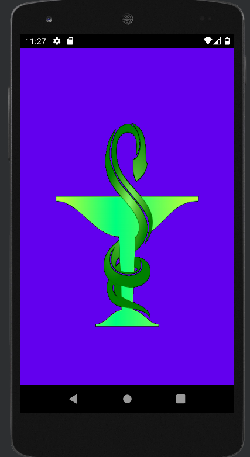

### Enlace Github
https://github.com/jrodriguezballester/Login.git
_______

# Login & SplashScrenn
## Práctica 5 - Crear un login con un activity de splash screen

Práctica 5 - Crear un login con un activity de splash screen
Vamos a crear una App con 3 actividades para la gestión de un login.

Ejercicio 1: (50%)

● Creamos una aplicación nueva para gestionar un login ...

Ejercicio 2: (50%)

Esta pasará a ser la activity principal del proyecto.
Vamos a crear un splash screen ...

## Resultado

Para la práctica se ha realizado una aplicación (commit Practica 5 Finalizada) cuya idea es tener la información en el móvil del control de las pastillas que se tiene que tomar la abuelita.

Para aumentar el nivel de conocimiento de las SharePreferences, las pastillas se guardan como un ArrayList de objetos Medicamento.

## Contenido

La app consta de

- #### Activities

	- ##### SplashScreen

		- Consistente en un Logo de Farmacia;

		- Carga las SharePreferences Email y contraseña

		- Redirecciona a Activity de Login o Main en función de las SharePreferences

	- ##### Login.

		- Logea al usuario si el Email y la Password son validos formalmente. Si el boton Switch esta marcado además los guarda en el Share Preferences

	- ##### MainActivity

		- Presenta la Activity principal de la App consistente en una serie de botones

		- Tiene un menú con las opciones

		- Log out.- Crea una nueva llamada a la Activity Login (olvidando los datos escritos en la pantalla

		- Log out & Forget .- Hace un Log out y además borra el SharePreferences

	- ##### DosisActivity

		- Presenta los medicamentos que se tiene que tomar la abuelita en TextView generados dinámicamente a partir de los valores del SharePreferences

	###### Version 1
	- ##### TratamientoActivity
		- Muestra los campos (nombre,dosis) a rellenar de Medicamento.
		- Boton Añadir que agrega el nuevo medicamento a la lista y lo guarda en SharePreferences
		- ListView personalizado que muestra los datos del medicamento
- #### Clases Java

	- ##### MyApp.

		- Se carga al iniciar la aplicación;

		- Guarda en SharePreferences el ArrayList < Medicamento >

		- Espera un segundo mostrando el SplashScreen.

	- ##### Medicamento

		- Define los objetos medicamentos con su nombre y dosis

		- la dosis se expresa como un String sin guiones; (P.ej una pastilla por la mañana y por la noche: Notación médica 1-0-1 Notación App : "101" )

	- ##### Utils

		- Métodos estaticos para la obtencion y borrado de las Sharepreferences

		- Métodos estaticos para la Validacion de campos

- #### Dependencias

	- ##### Gson

		- Facilita el serializado y des-serializado de Objetos y su representación en notación JSON

		- implementation 'com.google.code.gson:gson:2.8.5'

## Modificaciones respecto de los videos

- Se ha modificado en la clase SplashActivity, Validando Email y Pass a pesar de que vengan del SharePreferences; no creo que este de mas validarlo nuevamente por si el campo default no se deja como nulo y hay alguna modificacion como:

		public static String getEmailPreferences(SharedPreferences preferences) {

		return preferences.getString("EMAIL", "No se encuentra el Email");

		}

- Se han trasladado las validaciones a la clase Utils para así utilizarlos en Login e SplashActivity sin duplicar código.

- Se ha modificado el método removeSharePreferences() del MainActivity cambiando el método clear() por remove() para no borrar del SharePreferences el ArrayList

## Ampliaciones

- Se guarda en SharePreferences un ArrayList de Objetos

- Se añade la librería Gson para pasar objetos a Json y viceversa

- Creación dinámica de elementos en DosisActivity

##  Version 1

- Unificadas las variables preferences y su get que habia en cada Activity en una variable static en MyApp
- Funcionalidad a la Activity Tratamiento para poder añadir medicamentos al tratamiento; losd medicamentos se muestran en un listView personalizado
___________
## Imagenes

### SplashScreen

### Login

### MainActivity

#### Opciones del Menu

### DosisActivity

### Version 1.
#### TratamientoActivity

